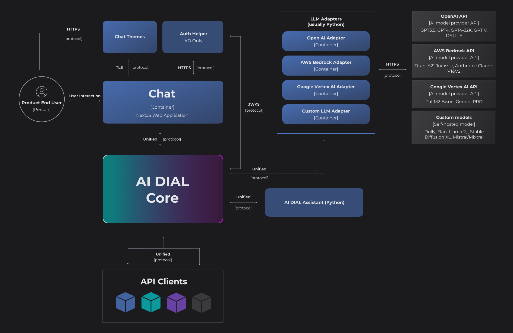

# dial

 

This chart can be used as an _umbrella_ chart to deploy several AI DIAL components in one package:

* [Core](https://github.com/epam/ai-dial-core)
* [Chat](https://github.com/epam/ai-dial-chat)
* [Chat Themes](https://github.com/epam/ai-dial-chat-themes)
* [Assistant](https://github.com/epam/ai-dial-assistant)
* [Auth Helper](https://github.com/epam/ai-dial-auth-helper)
* Adapters
  * [OpenAI](https://github.com/epam/ai-dial-adapter-openai)
  * [Bedrock](https://github.com/epam/ai-dial-adapter-bedrock)
  * [Vertex](https://github.com/epam/ai-dial-adapter-vertexai)

> You can also view them in [chart.yaml](./Chart.yaml)



## Prerequisites

- Helm 3.8.0+
- PV provisioner support in the underlying infrastructure (optional)
- Ingress controller support in the underlying infrastructure (optional)

## Requirements

Kubernetes: `>=1.23.0-0`

| Repository | Name | Version |
|------------|------|:---------:|
| https://charts.bitnami.com/bitnami | common | 2.14.1 |
| https://charts.bitnami.com/bitnami | keycloak | 16.1.7 |
| https://charts.epam-rail.com | core(dial-core) | 2.0.2 |
| https://charts.epam-rail.com | authhelper(dial-extension) | 1.0.3 |
| https://charts.epam-rail.com | chat(dial-extension) | 1.0.3 |
| https://charts.epam-rail.com | themes(dial-extension) | 1.0.3 |
| https://charts.epam-rail.com | openai(dial-extension) | 1.0.3 |
| https://charts.epam-rail.com | bedrock(dial-extension) | 1.0.3 |
| https://charts.epam-rail.com | vertexai(dial-extension) | 1.0.3 |
| https://charts.epam-rail.com | assistant(dial-extension) | 1.0.3 |

## Installing the Chart

To install the chart with the release name `my-release`:

```console
helm repo add dial https://charts.epam-rail.com
helm install --name my-release dial/dial
```

The command deploys AI DIAL on the Kubernetes cluster with default configuration. The [Parameters](#parameters) section lists the parameters that can be configured during installation.

## Uninstalling the Chart

To uninstall/delete the `my-release` deployment:

```console
helm delete my-release
```

The command removes all the Kubernetes components associated with the chart and deletes the release.

**NOTE**: Persistent Volumes created by StatefulSets won't be deleted automatically

## Parameters

There are two ways to specify configuration parameters: as arguments passed with the `helm install` command or using a values.yaml file. 

Specify each parameter using the `--set key=value[,key=value]` argument to `helm install`. For example:

```console
helm install my-release dial/dial --set chat.image.tag=latest
```

Alternatively, a YAML file that specifies the values for the above parameters can be provided while installing the chart. For example:

1. Create a values.yaml file with the necessary configuration paramaters:
   
```yaml
# values.yaml file content
chat:
  image:
    tag: latest
```
2. Use your values.yaml file as a source of configuration parameters when deploying a Helm chart:
    
```console
helm install my-release dial/dial -f values.yaml
```

## Configuring Values

> **NOTE**: You can use the default [values.yaml](values.yaml) file as a template. It includes all the components you can deploy using this chart with their minimal configurations.  

To configure each component, refer to relevant repositories for configuration details. You can find the list of repositories of the components in the first section of this document.

> **Examples**: due to flexibility of the system, it's impossible to define default values for all parameters and cover all use cases.\
However, we provide a set of [examples](examples) that can be used as a good starting point for your own configuration.

In the table below, you can find the list of parameters used in the defaut [values.yaml](values.yaml) file.

| Key | Type | Default | Description |
|-----|:------:|---------|-------------|
| keycloak.enabled | bool | `false` | Use this flag to enable/disable Keycloak |
| keycloak.extraEnvVars[0].name | string | `"KC_FEATURES"` |  |
| keycloak.extraEnvVars[0].value | string | `"token-exchange,admin-fine-grained-authz,declarative-user-profile"` |  |
| keycloak.keycloakConfigCli.enabled | bool | `true` |  |
| keycloak.keycloakConfigCli.extraEnvVars[0].name | string | `"IMPORT_VARSUBSTITUTION_ENABLED"` |  |
| keycloak.keycloakConfigCli.extraEnvVars[0].value | string | `"true"` |  |
| keycloak.postgresql.enabled | bool | `true` |  |
| keycloak.proxy | string | `"edge"` |  |
| core.enabled | bool | `true` | Use this flag to enable/disable ai-dial-core<br />Refer to [AI DIAL Core](https://github.com/epam/ai-dial-core) to view configuration guidelines. |
| core.image.tag | string | `"0.10.0"` | |
| authhelper.commonLabels."app.kubernetes.io/component" | string | `"authentication"` | Refer to  [AI DIAL Auth Helper](https://github.com/epam/ai-dial-auth-helper) to view configuration guidelines. |
| authhelper.containerPorts.http | int | `4088` |  |
| authhelper.enabled | bool | `false` | Use this flag to enable/disable ai-dial-auth-helper. Set `keycloak.enabled: true` before enabling this. |
| authhelper.image.repository | string | `"epam/ai-dial-auth-helper"` |  |
| authhelper.image.tag | string | `"0.3.0"` |  |
| chat.commonLabels."app.kubernetes.io/component" | string | `"application"` | Refer to [AI DIAL Chat](https://github.com/epam/ai-dial-chat) to view configuration guidelines. |
| chat.containerPorts.http | int | `3000` |  |
| chat.enabled | bool | `true` | Use this flag to enable/disable ai-dial-chat |
| chat.image.repository | string | `"epam/ai-dial-chat"` |  |
| chat.image.tag | string | `"0.11.0"` |  |
| themes.commonLabels."app.kubernetes.io/component" | string | `"webserver"` | Refer to [AI DIAL Chat Themes](https://github.com/epam/ai-dial-chat-themes) to view configuration guidelines. |
| themes.containerPorts.http | int | `8080` |  |
| themes.containerSecurityContext.runAsUser | int | `101` |  |
| themes.enabled | bool | `true` | Use this flag to enable/disable ai-dial-chat-themes |
| themes.image.repository | string | `"epam/ai-dial-chat-themes"` |  |
| themes.image.tag | string | `"0.4.0"` |  |
| themes.podSecurityContext.fsGroup | int | `101` |  |
| openai.commonLabels."app.kubernetes.io/component" | string | `"adapter"` |Refer to [AI DIAL Adapter OpenAI](https://github.com/epam/ai-dial-adapter-openai) to view configuration guidelines.  |
| openai.enabled | bool | `false` | Use this flag to enable/disable ai-dial-adapter-openai |
| openai.image.repository | string | `"epam/ai-dial-adapter-openai"` |  |
| openai.image.tag | string | `"0.11.0"` |  |
| bedrock.commonLabels."app.kubernetes.io/component" | string | `"adapter"` | Refer to [AI DIAL Adapter Bedrock](https://github.com/epam/ai-dial-adapter-bedrock) to view configuration guidelines. |
| bedrock.enabled | bool | `false` | Use this flag to enable/disable ai-dial-adapter-bedrock |
| bedrock.image.repository | string | `"epam/ai-dial-adapter-bedrock"` |  |
| bedrock.image.tag | string | `"0.11.0"` |  |
| bedrock.secrets | object | `{}` |  |
| vertexai.commonLabels."app.kubernetes.io/component" | string | `"adapter"` | Refer to [AI DIAL Adapter Vertex](https://github.com/epam/ai-dial-adapter-vertexai) to view configuration guidelines. |
| vertexai.enabled | bool | `false` | Use this flag to enable/disable ai-dial-adapter-vertexai |
| vertexai.image.repository | string | `"epam/ai-dial-adapter-vertexai"` |  |
| vertexai.image.tag | string | `"0.7.0"` |  |
| assistant.commonLabels."app.kubernetes.io/component" | string | `"application"` |Refer to [AI DIAL Assistant](https://github.com/epam/ai-dial-assistant) to view configuration guidelines.   |
| assistant.enabled | bool | `false` | Use this flag to enable/disable ai-dial-assistant |
| assistant.image.repository | string | `"epam/ai-dial-assistant"` |  |
| assistant.image.tag | string | `"0.7.0"` |  |
| extraDeploy | list | `[]` |  |
