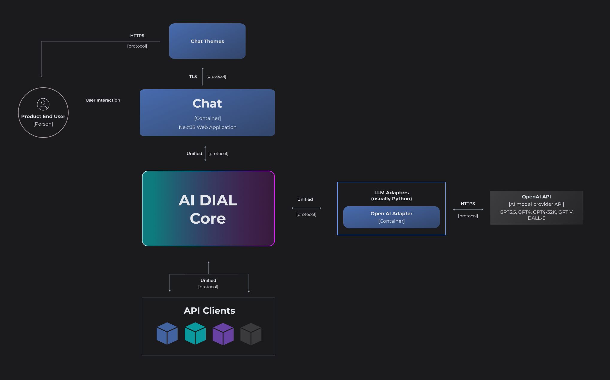

# AI DIAL Generic Installation Simple Guide

- [AI DIAL Generic Installation Simple Guide](#ai-dial-generic-installation-simple-guide)
  - [Prerequisites](#prerequisites)
  - [Expected Outcome](#expected-outcome)
  - [What's next?](#whats-next)
  - [Install](#install)
  - [Uninstall](#uninstall)
  

## Prerequisites

- Kubernetes cluster 1.24+
- [kubectl](https://kubernetes.io/docs/tasks/tools/#kubectl) installed and configured
- [Helm](https://helm.sh/docs/intro/install/) `3.8.0+` installed
- [Ingress-Nginx Controller](https://kubernetes.github.io/ingress-nginx/deploy/) installed in the cluster
- [cert-manager](https://cert-manager.io/docs/installation/) installed in the cluster (optional)
- [external-dns](https://github.com/kubernetes-sigs/external-dns) installed in the cluster (optional)
- [Azure OpenAI](https://learn.microsoft.com/en-us/azure/ai-services/openai/overview) `gpt-35-turbo` model deployed:
  - [Azure Model Deployment Guide](https://docs.epam-rail.com/Deployment/OpenAI%20Model%20Deployment)

## Expected Outcome

**Important Warning**

Please note that this guide **does not use a persistent disk** for data storage.\
Please note that this guide represents a very basic deployment scenario, and **should never be used in production**.\
Configuring authentication provider, encrypted secrets, model usage limits, Ingress allowlisting and other security measures are **out of scope** of this guide.

**Scope**

By following the instructions in this guide, you will install the AI DIAL system with the selcted minimal configurations (defined in the [values.yaml](values.yaml) file) of the following components: AI DIAL Core, AI DIAL Chat, AI DIAL Chat Themes and a connection to the Azure GPT-3.5 API.



## What's next?

Having installed the system with minimal settings and a limited scope of features, you can go further and learn how to create a custom [Configuration](https://docs.epam-rail.com/Deployment/configuration) and add more components.

Refer to a repository of each component to view a full set of configuration parameters and guidelines:

* [Core](https://github.com/epam/ai-dial-core)
* [Chat](https://github.com/epam/ai-dial-chat)
* [Chat Themes](https://github.com/epam/ai-dial-chat-themes)
* [Assistant](https://github.com/epam/ai-dial-assistant)
* [Auth Helper](https://github.com/epam/ai-dial-auth-helper)
* Adapters
  * [OpenAI](https://github.com/epam/ai-dial-adapter-openai)
  * [Bedrock](https://github.com/epam/ai-dial-adapter-bedrock)
  * [Vertex](https://github.com/epam/ai-dial-adapter-vertexai)

## Install

1. Create a Kubernetes namespace, e.g. `dial`

    **Command:**

    ```sh
    kubectl create namespace dial
    ```

    **Output:**

    ```console
    namespace/dial created
    ```

1. Add Helm chart repository

    **Command:**

    ```sh
    helm repo add dial https://charts.epam-rail.com
    ```

    **Output:**

    ```console
    "dial" has been added to your repositories
    ```

1. Copy [values.yaml](values.yaml) file to your working directory and fill in missing values:
    - Replace `%%NAMESPACE%%` with namespace created above, e.g. `dial`
    - Replace `%%DOMAIN%%` with your domain name, e.g. `example.com`
    - Replace `%%DIAL_API_KEY%%` with generated value (`pwgen -s -1 64`)
    - Replace `%%CORE_ENCRYPT_PASSWORD%%` with generated value (`pwgen -s -1 32`)
    - Replace `%%CORE_ENCRYPT_SALT%%` with generated value (`pwgen -s -1 32`)
    - Replace `%%NEXTAUTH_SECRET%%` with generated value (`openssl rand -base64 64`)
    - Replace `%%REDIS_PASSWORD%%` with generated value (`pwgen -s -1 32`)
    - Replace `%%AZURE_MODEL_ENDPOINT%%` with Azure OpenAI Model Endpoint from [prerequisites](#prerequisites), e.g. `https://not-a-real-endpoint.openai.azure.com/openai/deployments/gpt-35-turbo/chat/completions`
    - Replace `%%AZURE_MODEL_KEY%%` with Azure OpenAI Model Key from [prerequisites](#prerequisites), e.g. `3F0UZREXNOTAREALKEYDCvzSkznPFa`
    - It's assumed you've configured **external-dns** and **cert-manager** beforehand, so replace `%%CLUSTER_ISSUER%%` with your cluster issuer name, e.g. `letsencrypt-production`

2. Install `dial` helm chart in created namespace, applying a custom values.yaml file:

    **Command:**

    ```sh
    helm install dial dial/dial -f values.yaml --namespace dial
    ```

    **Output:**

    ```console
    Release "dial" does not exist. Installing it now.
    NAME: dial
    LAST DEPLOYED: Thu Nov 30 16:35:54 2023
    NAMESPACE: dial
    STATUS: deployed
    REVISION: 1
    TEST SUITE: None
    NOTES:
    CHART NAME: dial
    CHART VERSION: 1.0.0
    APP VERSION: 1.0
    ** Please be patient while the chart is being deployed **
    ```

3. Now you can access:
    - Chat by the following URL: `https://chat.%%DOMAIN%%/`, e.g. `https://chat.example.com/`
    - API by the following URL: `https://dial.%%DOMAIN%%/`, e.g. `https://dial.example.com/`
      - Use previously generated `%%DIAL_API_KEY%%` value

## Uninstall

1. Uninstall `dial` helm chart from created namespace

    **Command:**

    ```sh
    helm uninstall dial --namespace dial
    ```

    **Output:**

    ```console
    release "dial" uninstalled
    ```

1. Delete Kubernetes namespace, e.g. `dial`

    **Command:**

    ```sh
    kubectl delete namespace dial
    ```

    **Output:**

    ```console
    namespace "dial" deleted
    ```
